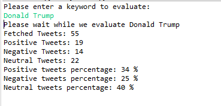
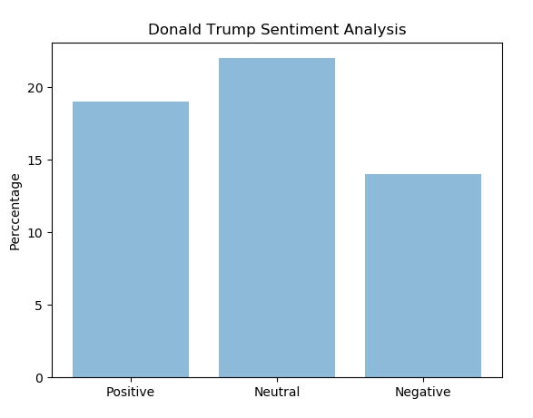

# Twitter [Sentiment Analysis](https://en.wikipedia.org/wiki/Sentiment_analysis) using Python
[Sentiment Analysis](https://en.wikipedia.org/wiki/Sentiment_analysis) on Twitter keywords using Python - using [Tweepy](http://docs.tweepy.org/en/v3.5.0/) and [TextBlob](https://textblob.readthedocs.io/en/dev/) libraries
and NLTK corpora. Data Visualization was done using [Matplotlib](https://pythonspot.com/matplotlib/).
-  Tweepy is the python client for the official [Twitter API](https://developer.twitter.com/en/docs).
-  TextBlob is the python library for processing textual data.

### Installation
-  Ensure you have python installed
-  Replace the following lines in TwitterClient.py with values from your Twitter Application from the developer account:  
`` 	consumer_key = 'XXXXXXXXXXXXXXXXXXXXXXXXXXXXXXXXX'  
	consumer_secret = 'XXXXXXXXXXXXXXXXXXXXXXXXXXXXXXXXX'  
	access_token = 'XXXXXXXXXXXXXXXXXXXXXXXXXXXXXXXXX'  
	access_token_secret = 'XXXXXXXXXXXXXXXXXXXXXXXXXXXXXXXXX'       
`` 
        
1.  Clone the repository  
`` git clone git@github.com:Gichure/twitter-sentiment-analysis.git ``  

2.  Go to the ``twitter-sentiment-analysis folder  
`` cd twitter-sentiment-analysis folder ``
3.  Go to the executable file folder  
`` cd src/com/pgichure/sentiment-analysis/ ``
4.  Execute the script "TwitterClient.py"  

```python
	python TwitterClient.py
```
You will be prompted to enter the keyword. Provide keyword and hit enter
  


### Contact

Send me an [email](mailto:gichurepaul@gmail.com) to build a sentiment analysis application for your unique business brands, campaigns and needs. Visit my [website](https://gichure.github.io/)

### Author
[Paul Gichure](https://gichure.github.io/)


